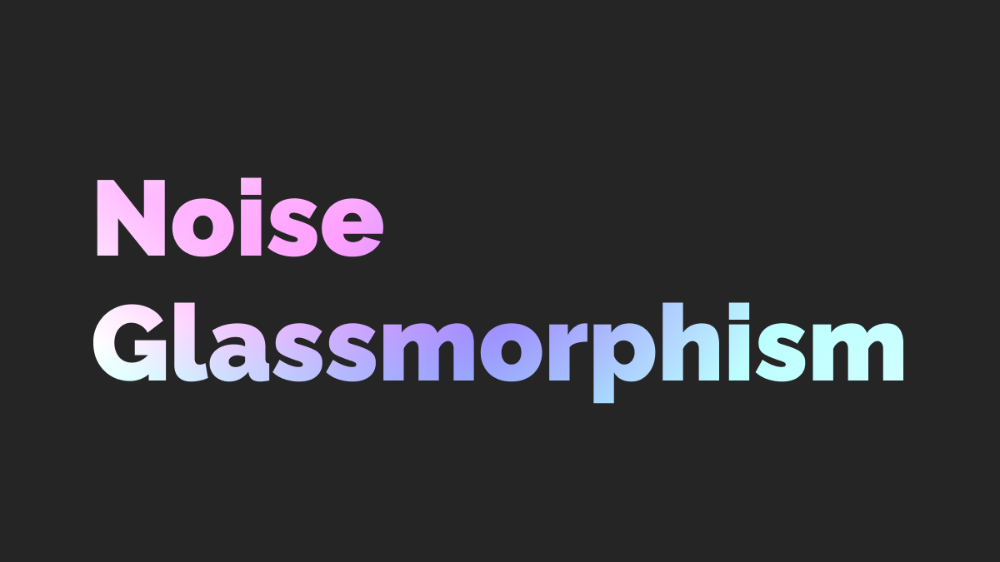

# 🌈 Noise Glassmorphism

<div align="center">
  

  <p align="center">
    <strong>モダンでインタラクティブなグラスモーフィズムUIの実装例</strong>
  </p>
</div>

## ✨ 特徴

- **🎨 ノイズテクスチャ**: SVG の feTurbulence フィルターを使用した独特な質感
- **🌗 ダイナミックな背景**: インタラクティブに再生成可能な装飾要素
- **💎 グラスモーフィズム**: 美しいブラーエフェクトとトランスペアレンシー
- **📱 レスポンシブ**: あらゆるデバイスで最適な表示を実現

## 🚀 デモ

[ライブデモを見る](https://line-gradient-card.vercel.app)

## 🛠️ 技術スタック

- **Next.js**: React ベースのフレームワーク
- **TypeScript**: 型安全な開発環境
- **Tailwind CSS**: ユーティリティファーストなスタイリング
- **shadcn/ui**: 美しく再利用可能な UI コンポーネント
- **Bun**: 高速なパッケージマネージャーとランタイム

## 🎯 使用例

```tsx
<NoiseGlassCard>
  <h2>ノイズ付きグラスモーフィズム</h2>
  <p>
    SVGのfeTurbulenceフィルターを使用して、
    すりガラスのような質感を実現したカードです。
  </p>
</NoiseGlassCard>
```

## 📦 インストール

```bash
# リポジトリのクローン
git clone git@github.com:imaimai17468/line-gradient-card.git

# 依存関係のインストール
bun install

# 開発サーバーの起動
bun dev
```

## 🔧 スクリプト

- `bun dev`: 開発サーバーの起動
- `bun build`: プロダクションビルド
- `bun start`: ビルドしたアプリの起動
- `bun format`: コードのフォーマット
- `bun check`: コードの静的チェック

## 📝 ライセンス

MIT © [imaimai17468](https://github.com/imaimai17468)

---

<div align="center">
  <p>Made with ❤️ by <a href="https://github.com/imaimai17468">imaimai17468</a></p>
</div>
